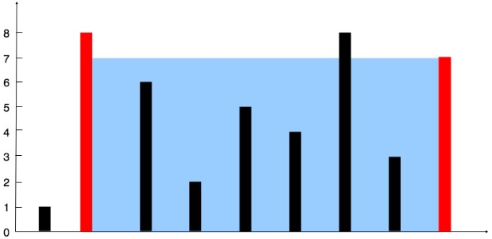

# makerfest-hackathon
Solutions our team programmed for the given problems at Superior Makerfest Hackathon.

### Problem 1 - Best Time to Buy and Sell Stock
Say you have an array for which the ith element is the price of a given stock on day i.
If you were only permitted to complete at most one transaction (i.e., buy one and sell one share of the stock), design an algorithm to find the maximum profit.\
Note that you cannot sell a stock before you buy one.
#### Example 1:
```
Input: [7,1,5,3,6,4]
Output: 5
Explanation: Buy on day 2 (price = 1) and sell on day 5 (price = 6), profit = 6-1 = 5.
             Not 7-1 = 6, as selling price needs to be larger than buying price.
```
#### Example 2:
```
Input: [7,6,4,3,1]
Output: 0
Explanation: In this case, no transaction is done, i.e. max profit = 0.
```

### Problem 2 - Search Insert Position
Given a sorted array and a target value, return the index if the target is found. If not, return the index where it would be if it were inserted in order.\
You may assume no duplicates in the array.
#### Example 1:
```
Input: [1,3,5,6], 5
Output: 2
 ```
#### Example 2:
```
Input: [1,3,5,6], 2
Output: 1
```
#### Example 3:
```
Input: [1,3,5,6], 7
Output: 4
```
#### Example 4:
```
Input: [1,3,5,6], 0
Output: 0
```

### Problem 3 - Longest Palindromic Substring
Given a string s, find the longest palindromic substring in s. You may assume that the maximum length of s is 1000.
#### Example 1:
```
Input: "babad"
Output: "bab"
```
Note: "aba" is also a valid answer.
#### Example 2:
```
Input: "cbbd"
Output: "bb"
```

### Problem 4 - Container With Most Water
Given n non-negative integers a1, a2, ..., an , where each represents a point at coordinate (i, ai). n vertical lines are drawn such that the two endpoints of line i is at (i, ai) and (i, 0). Find two lines, which together with x-axis forms a container, such that the container contains the most water.\
Note: You may not slant the container and n is at least 2.


#### Example:
```
Input: [1,8,6,2,5,4,8,3,7]
Output: 49
```

### Problem 5 - First Missing Positive
Given an unsorted integer array, find the smallest missing positive integer.
#### Example 1:
```
Input: [1,2,0]
Output: 3
```
#### Example 2:
```
Input: [3,4,-1,1]
Output: 2
```
#### Example 3:
```
Input: [7,8,9,11,12]
Output: 1
```
